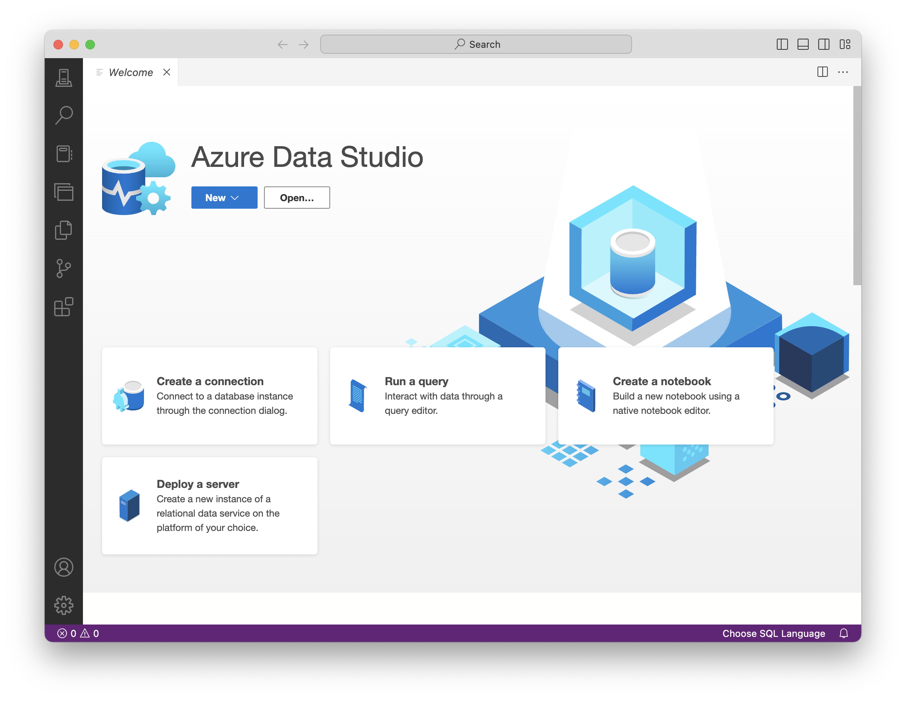
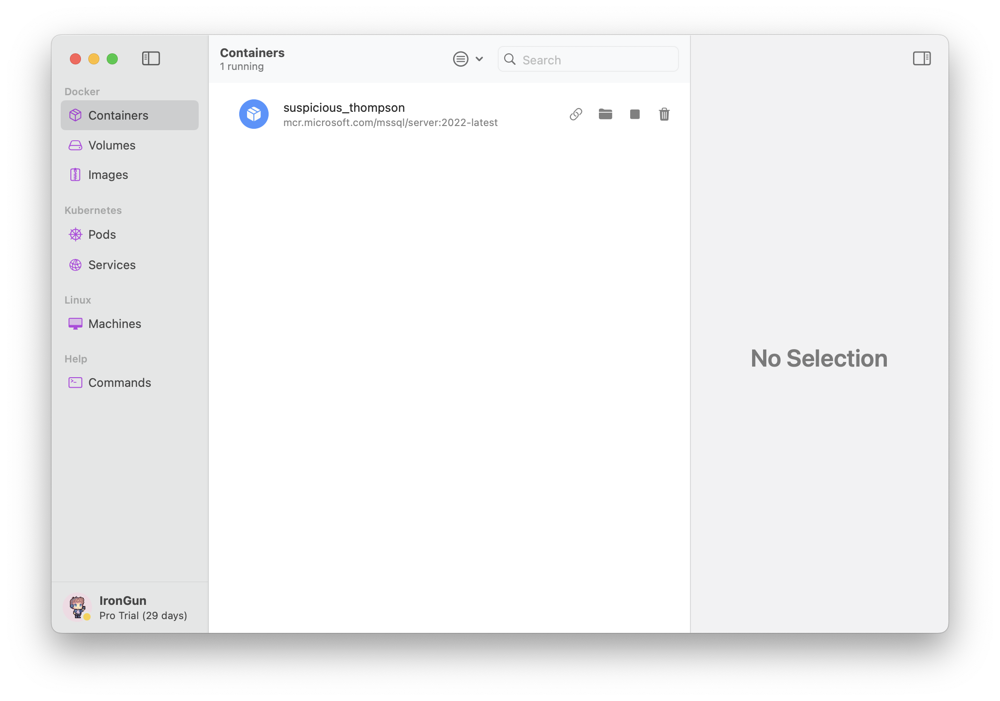
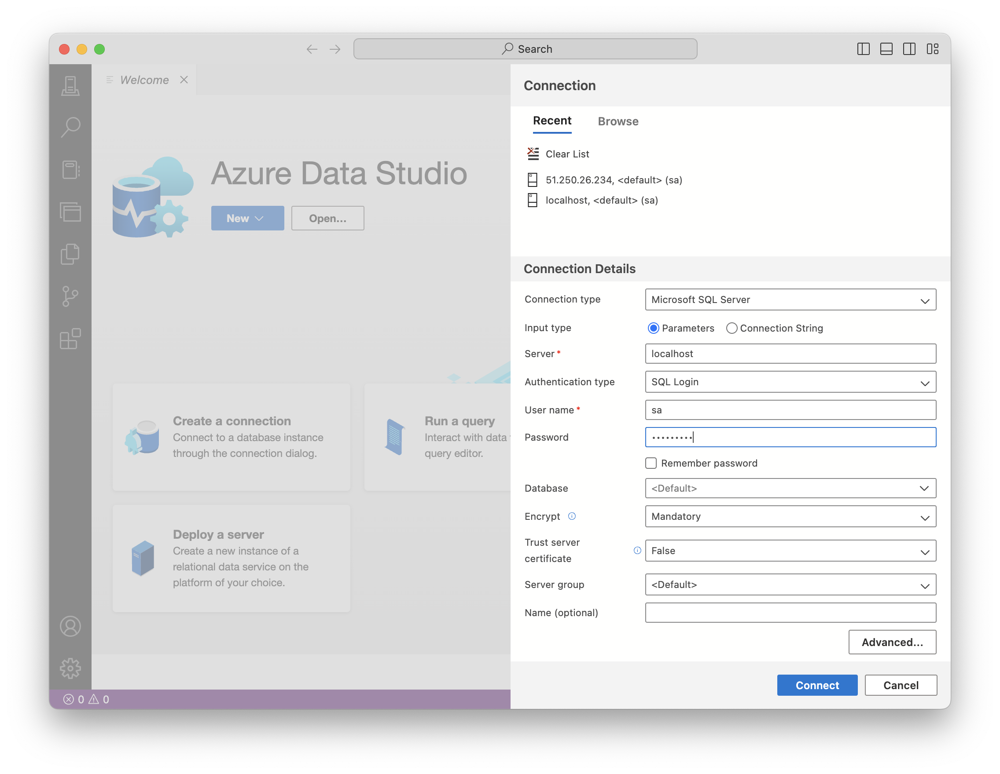
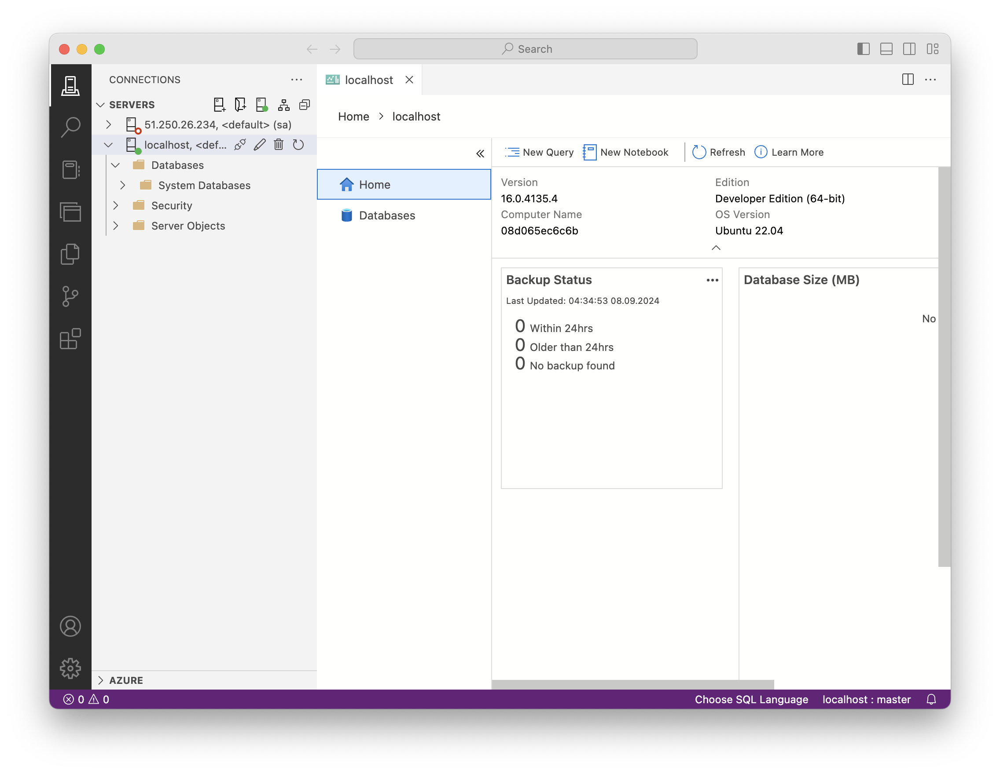
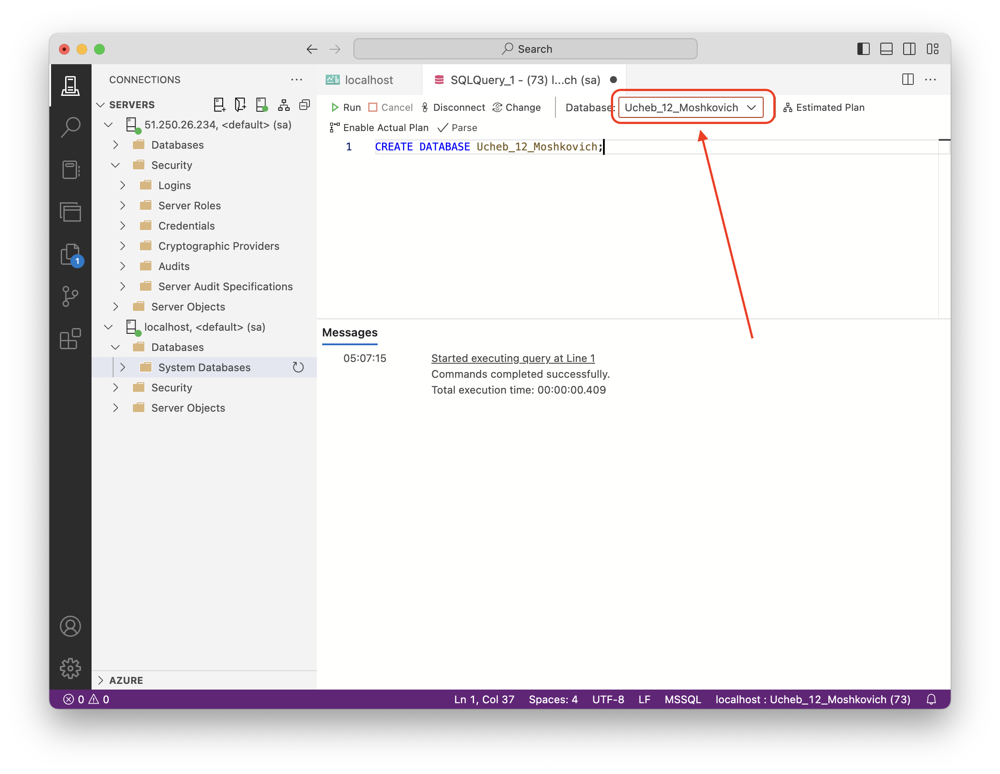
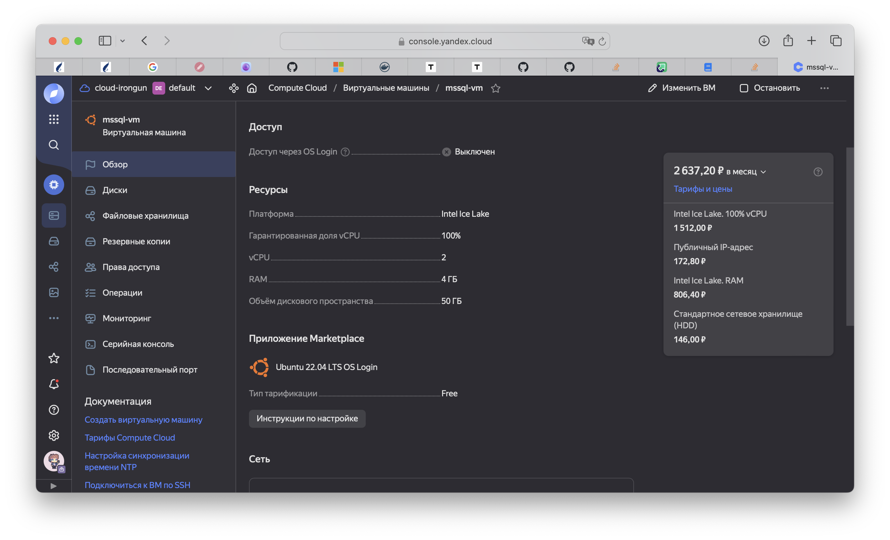

# Как настроить MSSQL под мак, если из знакомых баз только величина
[Демид](https://t.me/irongun)

Привет! Как вы знаете, в мире существует множество СУБД, многие из которых нативно настраиваются под мак, а запросы под них легко писать в многочисленных инструментах с красивым GUI. Как несложно понять из вступления, речь сегодня пойдет о СУБД без нативных утилит под macos - MSSQL. Сейчас я расскажу несколько вариантов как с нуля всё настроить и начать писать простые запросы

## Шаг 0. Введение

Для работы с MSSQL нам понадобится 2 вещи - сервер и клиент. В нашем случае, сервером выступает MSSQL Server. На нём и хранится сама база данных: сервер принимает и обрабатывает запросы, хранит данные. Сам по себе он работает в фоне, и к нему можно подключиться в любой момент. Клиентом в  нашем случае является утилита для написания SQL-запросов, которая будет их формировать и посылать на сервер, после чего отображать ответ.

В оригинальной идее сервер MSSQL запускается локально и крутится в фоне, а мы через SSMS (утилита для SQL запросов) пишем и отправляем запросы. Тут не стоит путать, что это два отдельных приложения, каждое из которых выполняет свою функцию. Собственно, поддержки ни того, ни другого под макос нет.

Как вариант, можно пробовать ставить виртуалку винды через parallels и запускать всё на ней по существующим инструкциям. Но виртуалка винды отбирает куда больше CPU и памяти, так что был выбран более лайтовый способ - виртуалка линукса. И не спешите закрывать инструкцию - ничего страшного происходить не будет :) (к слову, и без этого можно обойтись, если развернуть сервер в облаке, о чём напишу позже)

## Шаг 1. Установка клиента (Azure Data Studio)

В качестве среды для написания SQL-запросов будем использовать рекомендуемую Azure Data Studio (ADS). По интерфейсу она очень сильно напоминает vs code, так что всё должно быть понятно(и в целом мне она нравится даже больше, чем предлагаемая SSMS). И тут важно учесть, что используя ADS мы лишаем себя многих GUI-шных утилит, к примеру создание баз данных и таблиц через интерфейс - придётся писать SQL-запросы. Для себя не нашёл в этом никакой проблемы. И это по факту единственное отличие от варианта разработки из-под винды.

Переходим к установке. Качаем ADS с [официального сайта](https://learn.microsoft.com/en-us/azure-data-studio/download-azure-data-studio#download-azure-data-studio). Выбираем macos версию под Intel/Apple Silicon в зависимости от ноута, и классическим способом(перетаскиванием) устанавливаем приложение.

Ознакамливаемся с интерфейсом:



На деле, ADS настолько хорош, что даже сам предлагает настроить и запустить сервер локально. Правда для этого нужен работающий докер, да и всё равно у меня его скрипты не завелись, так что сделал всё сам.

## Шаг 2. Настройка докера

Сам сервер мы будем запускать через докер контейнер, а для этого нужно настроить докер и среду для контейнеров.

Ставим homebrew(при необходимости) и докер через терминал:
```shell
brew install docker
/bin/bash -c "$(curl -fsSL https://raw.githubusercontent.com/Homebrew/install/HEAD/install.sh)"
```

Далее нужно определиться со средой для контейнеров. Из мною рассмотренных:

* Docker Desktop (не рекомендуется) - официальный инструмент. Из минусов: нужны лицензии, частые слёты/блокировки
* colima - консольная утилита, которая быстро и просто делает делает аналог демона-докера и позволяет создавать контейнеры через стандартный CLI
* OrbStack - графическая утилита, которая обещает быть побыстрее и пооптимизированнее чем colima. Из плюсов: её видно в панели управления, красиво высвечивает список всех контейнеров, висит в доке(и понятно что конкретно отжирает память). Когда про ту же colima можно просто забыть

Рассмотрю сразу два варианта. Лично я использую OrbStack, но colima настроить быстрее (две строчки в консоль)

### Настройка colima

Тут всё просто - устанавливаем через brew и запускаем (в терминале):
```shell
brew install colima
colima start
```

Займёт ~1 гб места на диске, т.к. тут уже будет поставлена убунта. К ней, кстати, можно подключиться через `colima ssh`

Как остановить и почистить место (когда mssql server уже будет не нужен):
```shell
colima stop
colima delete
```

### Настройка OrbStack

Устанавливаем с [официального сайта](https://orbstack.dev/download). Free лицензии нам хватит, будем верить что бесплатной и останется (иначе - используйте colima)

Запускаем, при первичной настройке указываем, что будем использовать docker. Разрешаем всё, что запросит. Ubuntu ставить не надо

В интерфейсе нас интересует вкладка containers - тут пока пусто, в будущем тут будет контейнер с сервером


## Шаг 3. Запускаем MSSQL Server

Сам сервер через docker запускается очень просто. Актуальные команды всегда можно найти [тут](https://hub.docker.com/r/microsoft/mssql-server). Мы же используем (не забываем подставить пароль):

```
docker run -e "ACCEPT_EULA=Y" -e "MSSQL_SA_PASSWORD=ПОДСТАВИТЬ_ПАРОЛЬ" -p 1433:1433 -d mcr.microsoft.com/mssql/server:2022-latest
```

Если вы использовали OrbStack, можно проверить, что контейнер появился в списке:



На этом запуск сервера окончен :) Да, всё так просто

Сервер будет работать в фоне, даже если закрыть OrbStack на крестик (сверху в панели управления его всё ещё можно найти). У меня всё это дело отжирало ~1.5-2 гб оперативы, так что при неиспользовании лучше стопать контейнер через приложение (либо просто его закрывать)

## Шаг 4. Подключаемся к серверу

Заходим в ADS и на странице приветствия прожимаем `Create a connection`. Дальше заполняем как у меня (тут авторизация под sa). Подставляем пароль, который придумали ранее



Нашимаем `Connect`, `Enable trust server cetificate`. После чего успешно коннектимся к серверу



Здесь можно сделать запрос (`New query`), и сразу прописать:

```sql
CREATE DATABASE Ucheb_11_Fam;
```

Таким образом мы делаем себе основную базу данных, с которой и будем работать в будущем (ибо через интерфейс это сделать нельзя). В левой части интерфейса (вкладка `Connections`) можно раскрыть сервер->`Databases` и проверить, что она появилась

И ещё маленький момент - при выполнении запросов нужно не забывать указывать корректную базу данных:



На этом всё! Теперь можно писать и выполнять запросы в ADS, а сервер будет работать в докер контейнере. Не забывайте для экономии ресурсов после завершения работы стопать докер-контейнер

## Альтернативный вариант (без докера)

Решение сверху и вправду неплохое, но есть один минус - держать локально сервак базки, да ещё и в докере напряжно по ресурсам: и диску, и оперативе. Поэтому в качестве альтернативного варианта можно настроить сервер удалённо(в облаке). А подключаться всё так же через ADS

К примеру, я настроил виртуальную машину на Ubuntu в Яндекс.Облаке (хостинг можно брать любой), с конфигурацией:


Далее нужно разрешить входящий траффик на порт 1433 (по умолчанию). После чего конфигурируем MSSQL Server прямо на виртуалке - либо аналогично через docker (но тут уже можно ставить обычную либу, она сразу с демоном будет), либо [по стандартной инструкции](https://learn.microsoft.com/en-us/sql/linux/quickstart-install-connect-ubuntu?view=sql-server-ver16&tabs=ubuntu2204#install) (я так делал):

```shell
curl -fsSL https://packages.microsoft.com/keys/microsoft.asc | sudo gpg --dearmor -o /usr/share/keyrings/microsoft-prod.gpg
curl https://packages.microsoft.com/keys/microsoft.asc | sudo tee /etc/apt/trusted.gpg.d/microsoft.asc
curl -fsSL https://packages.microsoft.com/config/ubuntu/22.04/mssql-server-2022.list | sudo tee /etc/apt/sources.list.d/mssql-server-2022.list
sudo apt-get update
sudo apt-get install -y mssql-server
sudo /opt/mssql/bin/mssql-conf setup

systemctl status mssql-server --no-pager
```

После чего при подключении в ADS указываем ip/хост сервера и выбранный порт
